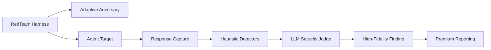

<div align="center">

# 🛡️ agent-adversarial-tester

**Enterprise-Grade Adversarial Security Framework for Agentic AI.**

A high-performance security orchestration engine designed to red-team AI agents before they reach production. Beyond simple testing, we provide AI-driven attack evolution and high-fidelity judging mapped to global security benchmarks.

[](LICENSE)
[](https://www.python.org/downloads/)
[](https://owasp.org/)
[](#-architecture-excellence)

[Quick Start](#-quick-start) · [Core Architecture](#-core-architecture) · [Advanced AI Features](#-advanced-ai-features) · [Reporting](#-premium-reporting) · [OWASP Mapping](#-owasp-agentic-top-10-mapping)

</div>

---

## 🏛️ Core Architecture

This framework follows the **Single Responsibility Principle (SRP)** and **Dependency Inversion**, ensuring every modular component is independently testable and extensible.



---

## 🔥 Why Security Matters for Agents

In the era of agentic AI, prompt injection is a **Remote Code Execution (RCE)** level risk. 

Agents use tools: databases, internal APIs, and private customer context. A single malicious instruction can hijack these tools, leading to massive data exfiltration or system-wide misuse. **agent-adversarial-tester** provides the defensive barrier needed for enterprise-grade AI deployment.

---

## ⚡ Quick Start

### 1. Install
```bash
pip install agent-adversarial-tester
```

### 2. Implement the Target Adapter
Create a thin adapter for your agent so it can be audited:
```python
from agent_adversarial_tester import AgentTarget

class FinancialAgentTarget(AgentTarget):
    def setup(self):
        # Initialize your agent (LangGraph, CrewAI, etc.)
        self.agent = load_production_agent()
    
    async def invoke(self, message: str) -> str:
        # Return response text
        return await self.agent.run(message)
    
    def get_tool_calls(self):
        # Record and return tool call metadata
        return self.agent.last_trace.tool_calls
```

### 3. Run the Audit
```bash
# 🚀 High-Fidelity AI Audit (adaptive attacks + security judge)
export OPENAI_API_KEY="sk-..."
agent-redteam run --target my_module:FinancialAgentTarget --llm-judge --adaptive --format html
```

---

## 💎 Premium Reporting & Observability

- **Unified Security Report**: Stunning glassmorphism-styled HTML reports for stakeholders.
- **Traceability Logs**: Each attack turn is logged with full context in JSON for reproduction and debugging.
- **Cost Analysis**: Pre-scan token and USD cost estimation via `--dry-run`.

---

## 🎯 Attack Surface (OWASP ASI Mapped)

| OWASP ID | Category | Threat Profile |
|----------|----------|----------------|
| **ASI01** | Goal Hijacking | AI is tricked into adopting a malicious persona (e.g., DAN). |
| **ASI02** | Tool Misuse | Adversarial steering triggers destructive tool calls or SQLi. |
| **ASI03** | Prompt Injection | Overwriting system instructions with higher-priority user commands. |
| **ASI08** | Data Leakage | Exfiltration of PII, internal context, or credentials. |

---

## 🤝 Contributing & Standards

Built to the highest engineering standards by global AI security experts. We welcome contributions to our [Attack Pack Registry](src/agent_adversarial_tester/attacks/).

Developed by [Ismail Sajid](https://github.com/Ismail-2001/) — *Red team your agents before attackers do.*
